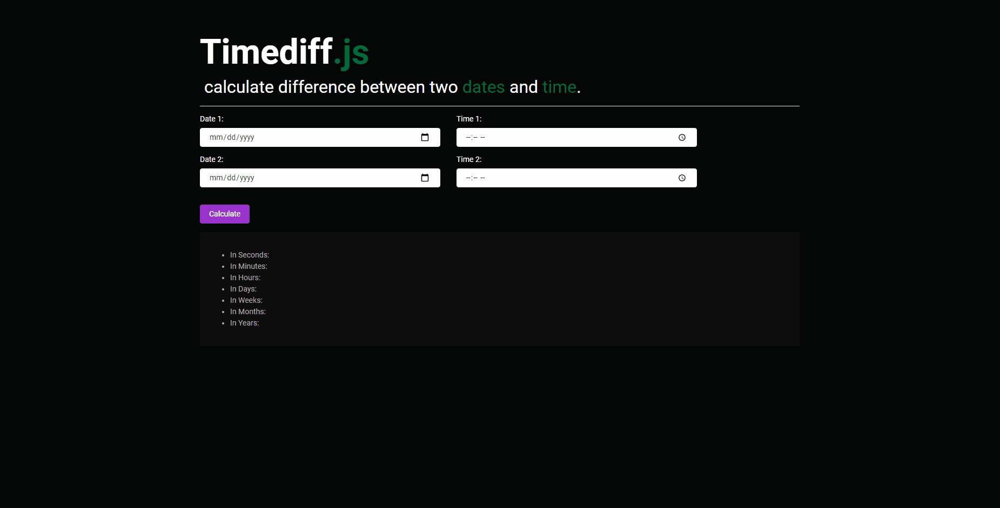

# **Timediff.js**

> A Javascript program that finds the difference between two **Dates** and **Time**.

> Displays difference in *Seconds*, *Minutes*, *Hour*, *Day*, *Week*, *Month* and  *Year*.

**POLGOMEZ**
